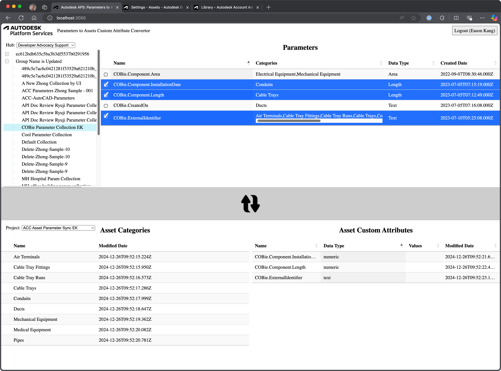

# Sample - APS Parameters Assets Custom Attributes Converter

## Description

This sample demonstrated the capabilities of importing categories and parameter definitions from [Autodesk Parameter Services](https://aps.autodesk.com/autodesk-parameters-service) to Autodesk Build Assets' categories and custom fields using [Autodesk APS](https://aps.autodesk.com) API, especially ACC Assets API and Parameters API. 

This simple application is built by following the [Hubs Browser](https://tutorials.autodesk.io/tutorials/hubs-browser/) tutorial from hhttps://aps.autodesk.com/tutorials.

# Demonstration

Here is the video demonstrating how this sample works quickly.

## Development

### Prerequisites

- [APS application](https://aps.autodesk.com/en/docs/oauth/v2/tutorials/create-app)
- Provisioned access to [Autodesk Docs](https://aps.autodesk.com/en/docs/bim360/v1/tutorials/getting-started/manage-access-to-docs/)
or Autodesk Construction Cloud
- [Node.js](https://nodejs.org) (we recommend the Long Term Support version)
- Terminal (for example, [Windows Command Prompt](https://en.wikipedia.org/wiki/Cmd.exe)
or [macOS Terminal](https://support.apple.com/guide/terminal/welcome/mac))

### Setup & Run

- Clone this repository
- Install dependencies: `yarn install` or `npm install`
- Setup environment variables:
  - `APS_CLIENT_ID` - your APS application client ID
  - `APS_CLIENT_SECRET` - your APS application client secret
  - `APS_CALLBACK_URL` - URL for your users to be redirected to after they successfully log in with their Autodesk account
    - For local development, the callback URL is `http://localhost:8080/api/auth/callback`
    - For applications deployed to a custom domain, the callback URL is `http://<your-domain>/api/auth/callback` or `https://<your-domain>/api/auth/callback`
    - Do not forget to update the callback URL for your application in https://aps.autodesk.com/myapps as well
  - `SERVER_SESSION_SECRET` - arbitrary phrase used to encrypt/decrypt server session cookies
- Run the server: `yarn start` or `npm start`

> When using [Visual Studio Code](https://code.visualstudio.com),
you can specify the env. variables listed above in a _.env_ file in this
folder, and run & debug the application directly from the editor.

## Troubleshooting

Please contact us via https://aps.autodesk.com/en/support/get-help.

# Further Reading

Documentation:

- [Parameter API](https://aps.autodesk.com/developer/overview/parameters-api)
- [ACC/BIM360 Assets API Field Guide](https://aps.autodesk.com/en/docs/acc/v1/overview/field-guide/assets/)
- [ACC API](https://aps.autodesk.com/developer/overview/autodesk-construction-cloud) and [App Provisioning](https://get-started.aps.autodesk.com/#provision-access-in-other-products)
- [Data Management API](https://aps.autodesk.com/en/docs/data/v2/overview/)

Tutorials:

- [Setup ACC/BIM360 Assets Project Settings](https://aps.autodesk.com/en/docs/acc/v1/tutorials/assets/create-assets-project-settings/)
- [Retrieve ACC/BIM360 Assets Data](https://aps.autodesk.com/en/docs/acc/v1/tutorials/assets/retrieve-assets-data/)
- [Managing ACC/BIM360 Assets](https://aps.autodesk.com/en/docs/acc/v1/tutorials/assets/manage-assets/)
- [APS Tutorial - Hubs Viewer](https://get-started.aps.autodesk.com/tutorials/hubs-browser/)

Blogs:

- [APS Blog](https://aps.autodesk.com/apis-and-services/autodesk-construction-cloud-acc-apis)
- [Field of View](https://fieldofviewblog.wordpress.com/), a BIM focused blog

## License

This sample is licensed under the terms of the [MIT License](http://opensource.org/licenses/MIT).
Please see the [LICENSE](LICENSE) file for more details.

## Written by

Eason Kang [in/eason-kang-b4398492/](https://www.linkedin.com/in/eason-kang-b4398492), [Developer Advocacy and Support Team](http://aps.autodesk.com)
